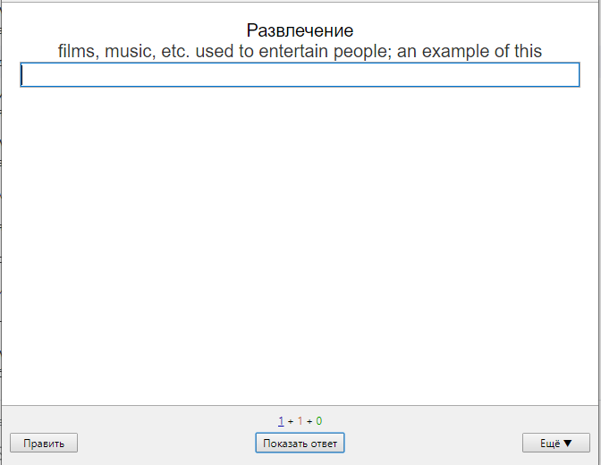
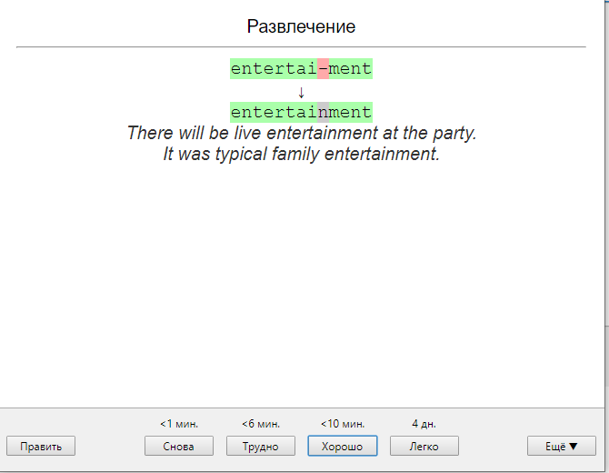

# Описание и цель проекта
**Описание**

Сервис для хранения и заучивания иностранных слов. Пользователь создаёт свои колоды, наполняет их словами и тренирует запоминание по средством ввода ответа вручную.

**Цель**
- Разработать MVP реализующий основные функции.
- Приобрести опыт командой работы. (GitHub)
- Разрабатывать в команде, поддерживать и деплоить.

# Основной фичлист
**MVP:**

- Сервис должен иметь возможность зарегистрироваться пользователю. На данном этапе это: регистрация, авторизация и выход. Данные для ввода: почта, пароль. Для регистрации пользователь вводит свою почту и придумывает пароль длинной не менее 8 символов с хотя бы одной заглавной буквой и одним символом. (например fsdf.sdfsJ) В начальной версии подтверждение на почту не приходит.
- Пользователь может создавать свои колоды. Кол-во колод неогранчиено. Пока. Для каждой колоы доступно название, описание.
- Пользователь может создавать свои карточки слов, которые находятся в колоде.
- Поля карточки: 
    -слово,
    -определение (definition),
    -поле ввода,
    -примеры использования слова.
- Пользователь после того, как ответил, может выбрать когда в следующий раз показать это слово снова. (если легко ответил то можно через 4 дня, а если сложно то уже завтра надо показать еще раз)
- На главной странице если пользователь авторизован показываем Dashboard колод.
- На колодах отображается сколько слов внутри, кнопка добавить слово, отредактировать параметры колоды.

---

Пример карточки до того, как пользователь ввел слово. Как показано есть слово, которое надо тренировать, есть определение этого слова на языке, который пользователь учит и есть поле для ввода ответа. Все поля задаются пользователем при создании карточки.

Пример карточки после того, как пользователь ввел слово. После  ввода слова у нас появляется правильный ответ и выбор когда данную картчоку показать снова. В зависимости от того, насколько пользователь оценивает легкость слова он делает выбор. Обозначение где ошибся пользователь для MVP не реализуется. Примеры использования слова пользователь заносит самостоятельно при создании карточки.

